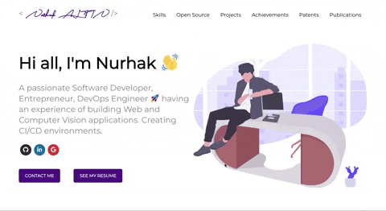

# Nurhak ALTIN Portfolio [](https://app.netlify.com/sites/confident-kare-3ca8ee/deploys)

https://www.nurhakaltin.com



## Getting Started 🚀

These instructions will get you a copy of the project up and running on your local machine for development and testing purposes.

You'll need [Git](https://git-scm.com) and [Node.js](https://nodejs.org/en/download/) (which comes with [npm](http://npmjs.com)) installed on your computer or use [Docker](https://www.docker.com/products/docker-desktop).

```
node@v10.16.0 or higher
npm@6.9.0 or higher
git@2.17.1 or higher
```

## Docker Commands 

```
1) BUILD IMAGE : docker build -t developerfolio:latest .
2) RUN IMAGE: docker run -p 3000:3000 developerfolio:latest
```

Inherited from https://github.com/saadpasta/developerFolio
